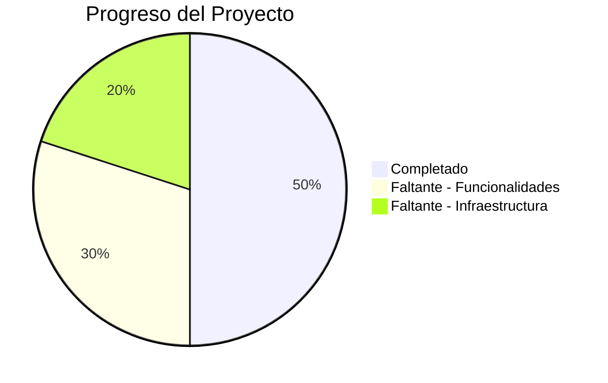

# 📊 Análisis del Proyecto - Estado Actual vs Planificado

## 📋 Resumen Ejecutivo

El proyecto es una API REST para un sistema de ventas B2B con Spring Boot. Tiene una estructura base sólida con **seguridad implementada** y lista para producción.

---

## ✅ LO IMPLEMENTADO (Completado)

### 🔐 Seguridad y Autenticación
| Funcionalidad | Estado | Notas |
|---------------|--------|-------|
| Registro de usuarios | ✅ | En AuthController |
| Login JWT | ✅ | Con access/refresh tokens |
| Refresh token | ✅ | RefreshToken entity y servicio |
| 2FA (TOTP) | ✅ | TotpService con generación QR |
| Recuperación de contraseña | ✅ | Token-based |
| Cambio de contraseña | ✅ | En UserController |
| Logout | ✅ | Invalidación de tokens |
| Roles y permisos | ✅ | Role entity básica |
| Hash de contraseñas | ✅ | BCrypt |
| Rate limiting | ✅ | RateLimitingService |

### 🏢 Empresas
| Funcionalidad | Estado | Notas |
|---------------|--------|-------|
| Company entity | ✅ | CRUD completo |
| Relación User-Company | ✅ | ManyToOne |

### 📦 Productos
| Funcionalidad | Estado | Notas |
|---------------|--------|-------|
| Product entity | ✅ | Con priceTiers (JSON) |
| Category entity | ✅ | CRUD completo |
| Product-Category | ✅ | Relación existente |

### 🛒 Ventas
| Funcionalidad | Estado | Notas |
|---------------|--------|-------|
| Order entity | ✅ | Con estados completos |
| OrderItem entity | ✅ | Snapshot de productos |
| Payment entity | ✅ | Básico |
| Estados de pedido | ✅ | CART, PENDING_PAYMENT, PAID, SHIPPED, DELIVERED, CANCELLED |

---

## ❌ LO QUE FALTA (No Implementado)

### 🚨 PROBLEMAS DE SEGURIDAD ANTERIORES (YA CORREGIDOS)

| Problema | Severidad | Estado |
|----------|-----------|--------|
| SecurityConfig abierto | 🔴 CRÍTICO | ✅ CORREGIDO |
| Sin JWT Filter | 🔴 CRÍTICO | ✅ CORREGIDO |
| Sin autorización | 🔴 CRÍTICO | ✅ CORREGIDO |

### 📦 Productos
- ❌ **ProductImage entity** - No existe para múltiples imágenes
- ❌ **Atributos variables** - Tallas, colores, etc.
- ❌ **Carrito persistente** - Se guarda aunque cierre sesión
- ❌ **Guardar carrito para después**
- ❌ **Lista de deseos (Favoritos)**
- ❌ **Cotizaciones (B2B)** - Solicitar cotización sin comprar
- ❌ **Pedidos recurrentes** - Compras automáticas programadas

### 💰 Descuentos y Precios
- ❌ **Cupones de descuento**
- ❌ **Descuentos por método de pago**
- ❌ **Límites de crédito** - Comprar ahora, pagar después
- ❌ **Precios especiales por empresa** (parcial - solo priceTiers genérico)

### 📝 CMS (Gestión de Contenido)
- ❌ **ContentBlock entity** - No existe
- ❌ **Página principal** - Hero, banners, destacados
- ❌ **About Us / Nosotros**
- ❌ **Información de contacto**
- ❌ **Políticas** (términos, privacidad)
- ❌ **Banners promocionales**
- ❌ **Noticias / Blog**

### 🖼️ Archivos y Multimedia
- ❌ **Subida de imágenes** - No hay endpoint de upload
- ❌ **S3/Cloudinary** - Integración no existe
- ❌ **Avatar de usuario** - Campo existe pero sin upload

### 🔐 Seguridad Adicional
- ❌ **AuditLog entity** - Registro de auditoria no existe
- ❌ **Protección CSRF** - Deshabilitada explícitamente (pero OK para API REST)
- ❌ **HTTPS obligatorio** - No configurado

### 📬 Notificaciones
- ❌ **NotificationTemplate entity**
- ❌ **UserNotification entity**
- ❌ **Servicio de email completo**

### 🏢 Empresas Adicional
- ❌ **CompanyAddress entity** - Múltiples direcciones
- ❌ **ShippingZone entity** - Zonas de envío

### 💳 Pagos
- ❌ **Integración con Stripe/MercadoPago** - Solo webhooks básicos
- ❌ **Procesamiento real de pagos**

### 📋 Entidades Planeadas Faltantes
- ❌ Media (archivos)
- ❌ Quote (cotizaciones B2B)
- ❌ FavoriteProduct
- ❌ Setting

### 🏗️ Infraestructura
- ❌ **Flyway** - Migraciones de BD
- ❌ **MapStruct** - Mapeo DTOs (manual)
- ❌ **Docker** - No configurado
- ❌ **Frontend** - No existe (solo API)

---

## 🎯 Reglas de Seguridad Implementadas

### Endpoints Públicos (sin auth)
- `/api/auth/**` - Login, registro, refresh token, recuperación de contraseña

### Endpoints solo ADMIN
- `/api/users/**` - Gestión de usuarios
- `/api/roles/**` - Gestión de roles

### Endpoints ADMIN y COMPANY_ADMIN
- `/api/companies/**` - Gestión de empresas (lectura: ambos, escritura: solo ADMIN)

### Endpoints USER, COMPANY_ADMIN, ADMIN
- `/api/products/**` - Productos (lectura: todos, escritura: COMPANY_ADMIN y ADMIN)
- `/api/categories/**` - Categorías (lectura: todos, escritura: COMPANY_ADMIN y ADMIN)
- `/api/orders/**` - Pedidos (lectura/escritura: todos)

---

## 📊 Estado de Avance General

### Porcentajes Aproximados:
- **Completado**: ~50% (incluyendo seguridad completa)
- **Faltante**: ~50%

---

## 🎯 Plan de Acción Priorizado

### Inmediato (Día 1-2)
1. ✅ Corregir SecurityConfig - cerrar endpoints
2. ✅ Agregar JWT Filter a la cadena de seguridad
3. ✅ Agregar validación de roles

### Corto Plazo (Semana 1-2)
4. Agregar ProductImage entity
5. Implementar upload de imágenes
6. Agregar CMS básico (ContentBlock)
7. Implementar AuditLog

### Mediano Plazo (Semana 3-4)
8. Agregar favoritos/lista de deseos
9. Implementar descuentos/cupones
10. Agregar cotizaciones B2B
11. Carrito persistente

### Largo Plazo
12. Integración con pasarela de pagos
13. Docker y despliegue
14. Notificaciones completas
15. Frontend React

---

## 📝 Conclusiones

1. **Buena base de arquitectura** - N-capas, módulos separados, DTOs
2. **Gran problema de seguridad** - Todo está abierto al público
3. **Falta mucho para producción** -CMS, media upload, audit logging
4. **Necesita tests** - No hay tests unitarios visibles

El proyecto está en un estado de desarrollo inicial con una estructura correcta pero con brechas importantes que deben resolverse antes de cualquier uso en producción.
